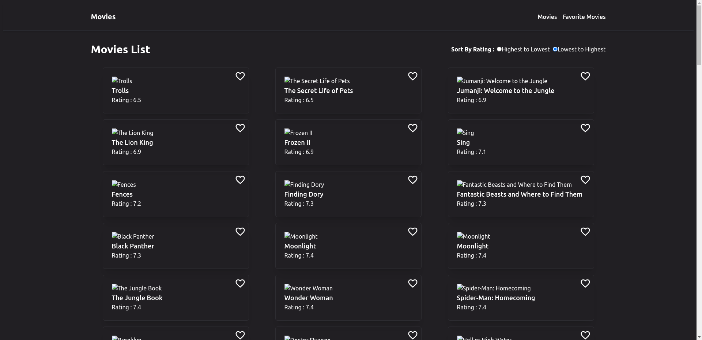

# [Demo Video Link](https://www.awesomescreenshot.com/video/28027993?key=38251b8c1aff6af70d209f6aa9fa813b)

# Getting Started

- Clone the repository on your local machine with the comman below in your terminal and cd into **stratex-frontend-assignment**

```sh
 git clone https://github.com/gkumar-pandey/stratex-frontend-assignment.git

 cd stratex-frontend-assignment
```

- Install dependencies (if you are using **yarn** do with that)

```sh
npm install
```

- Create a **.env** file at the root level of the directory (at the level of `package.json` file) and create a environment variable

```sh
 VITE_REACT_API_URL = https://dummyapi.online/api/movies
```

- Start the server 🔥

```sh
npm run dev
```
